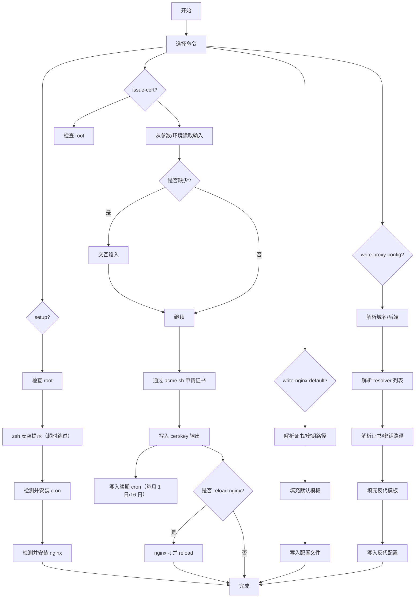

# 流程图

```mermaid
flowchart TD
    A[开始] --> B[选择命令]
    B --> S{setup?}
    B --> C{issue-cert?}
    B --> D{write-nginx-default?}
    B --> E{write-proxy-config?}

    S --> S1[检查 root]
    S1 --> S2[zsh 安装提示（超时跳过）]
    S2 --> S3[检测并安装 cron]
    S3 --> S4[检测并安装 nginx]
    S4 --> C9

    C --> C0[检查 root]
    C --> C1[从参数/环境读取输入]
    C1 --> C2{是否缺少?}
    C2 -->|是| C3[交互输入]
    C2 -->|否| C4[继续]
    C3 --> C4
    C4 --> C5[通过 acme.sh 申请证书]
    C5 --> C6[写入 cert/key 输出]
    C6 --> C6a[写入续期 cron（每月 1 日/16 日）]
    C6 --> C7{是否 reload nginx?}
    C7 -->|是| C8[nginx -t 并 reload]
    C7 -->|否| C9[完成]
    C8 --> C9

    D --> D1[解析证书/密钥路径]
    D1 --> D2[填充默认模板]
    D2 --> D3[写入配置文件]
    D3 --> C9

    E --> E1[解析域名/后端]
    E1 --> E2[解析 resolver 列表]
    E2 --> E3[解析证书/密钥路径]
    E3 --> E4[填充反代模板]
    E4 --> E5[写入反代配置]
    E5 --> C9
```
